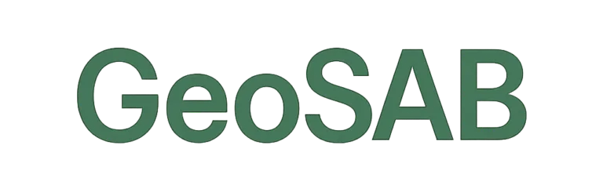

<p align="center">
  
</p>

# 🌵 GeoSAB – Por um Semiárido Produtivo e Sustentável

**GeoSAB** é uma plataforma interativa para visualização e consulta de dados geográficos, ecológicos e agrícolas relacionados ao **semiárido brasileiro**. Seu objetivo é apoiar a pesquisa, o planejamento e o uso sustentável dos recursos naturais na região.

---

## 🔍 O que é?

O sistema permite acessar, explorar e baixar informações organizadas sobre:

-  🌿 Plantas xerófitas com potencial agrícola e ecológico
- 🗺️ Visualização interativa dos **solos do semiárido**, com destaque para:
  - Latossolos
  - Cambissolos
  - Luvissolos
  - 📖 Descrições técnicas das classes de solo
- 🏞️ Camadas adicionais:
  - Limites do semiárido
  - Limites dos Estados do Semiárido
  - Limites do Bioma Caatinga
- ✂️ Recorte dos solos por município com **opção de download em shapefile**

---

## 🧭 Como usar

1. Acesse a plataforma pelo link abaixo.
2. Navegue pelas páginas disponíveis na barra lateral.
3. Selecione o tipo de solo desejado.
4. Visualize, interaja e exporte os dados para uso local.

---

## 🚀 Acesse o GeoSAB

👉 [https://geosab.streamlit.app](https://geosab.streamlit.app)

---

## 🛠️ Tecnologias utilizadas

- **Python 3.10+**
- **Streamlit**
- **GeoPandas** / **Shapely**
- **Folium** / **Leaflet.js**
- **Pandas**, **Matplotlib**
- **HTML + CSS** para customização leve

---

## 📦 Organização do projeto

```plaintext
├── dados/              # Arquivos geoespaciais (shapefiles, GeoJSON)
├── images/             # Imagens usadas na interface (ex: logo)
├── pages/              # Páginas da aplicação (ex: visualização de solos)
├── plant_datum/        # Funções de acesso aos dados relacionadas às espécies vegetais
├── utils/              # Funções utilitárias (leitura, processamento, filtros)
├── .gitignore          # Arquivos/diretórios ignorados pelo Git
├── Home.py             # Página inicial do app Streamlit
├── readme.md           # Este arquivo com descrição do projeto
├── xerofilas.db        # Banco de dados local das xerófilas (SQLite)
```

## 👨‍💻 Autor

Desenvolvido por [Danilo Andrade Santos](https://daniloas.com)

Com apoio de:

- 🌱 [codigoagro.com](https://codigoagro.com)
- 📊 [dadosagro.com](https://dadosagro.com)

---

## 📄 Licença

Este projeto é de uso acadêmico e institucional. Entre em contato com o autor para colaborações ou distribuição.

> “A sustentabilidade nasce do conhecimento aplicado ao território.”  
> — 🌎 Equipe GeoSAB